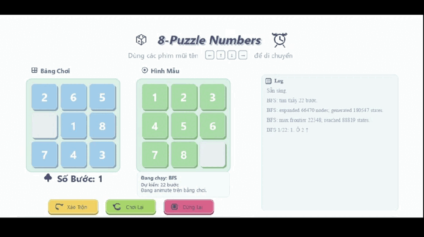
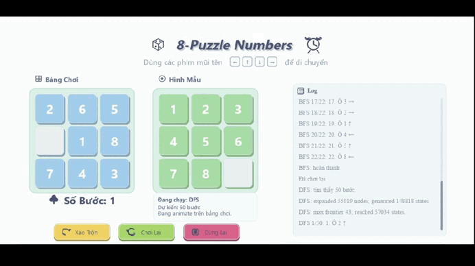
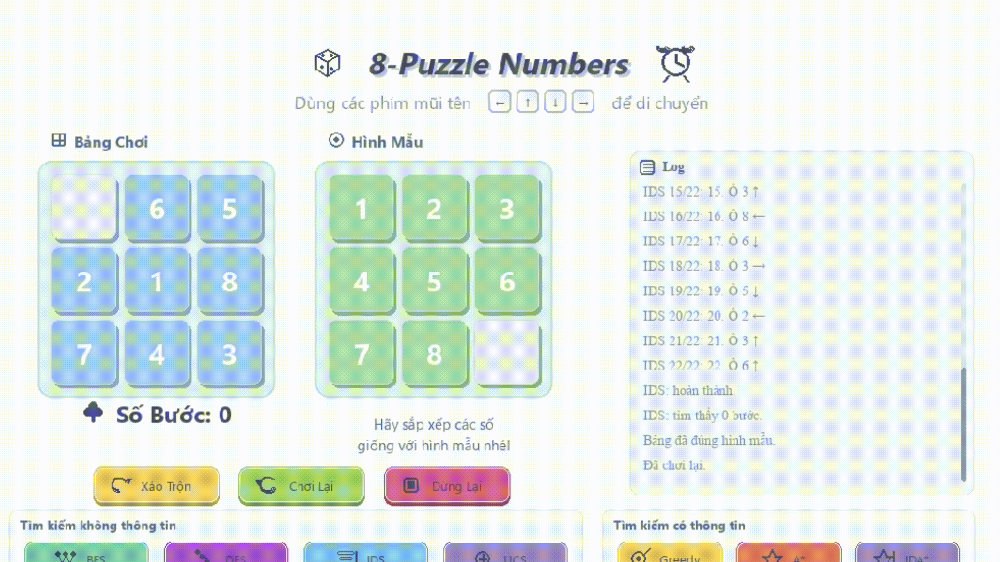
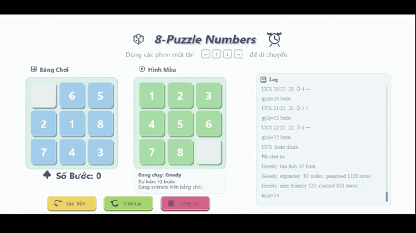
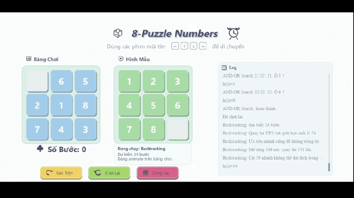
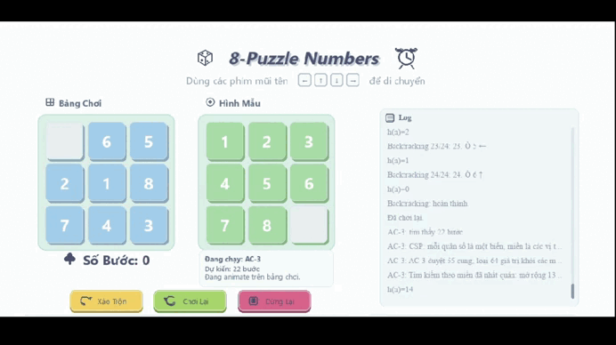
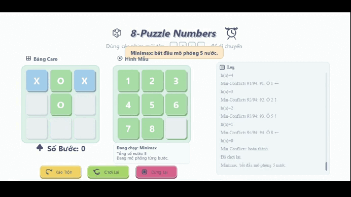
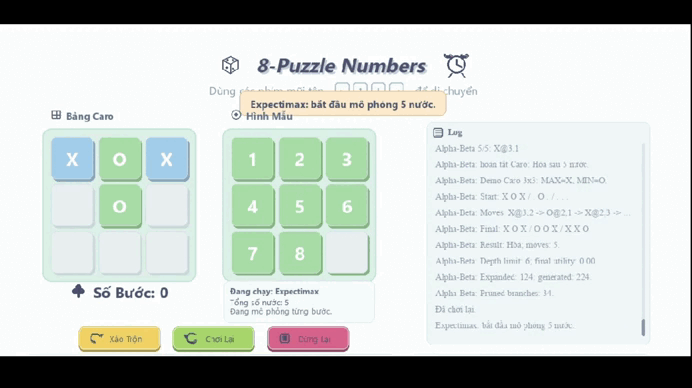

# 8-Puzzle AI - Search Algorithms Visualization

## 0. Chạy nhanh

Dự án này mô phỏng bài toán **8-Puzzle** bằng **Python + Pygame**. Người dùng có thể tự chơi bằng phím mũi tên hoặc bấm từng thuật toán để chương trình tự tìm đường đi và animate kết quả trên giao diện.

File chạy chính của dự án:

```bash
python main.py
```

Cài thư viện cần thiết:

```bash
python -m pip install pygame
```

Chạy chương trình:

```bash
python main.py
```

Nếu máy đang đứng ở thư mục cha, chuyển vào thư mục chứa `main.py` trước:

```bash
cd 8_puzzle
python main.py
```

Thoát chương trình bằng phím `ESC`.

---

## 0.1. Tổng quan dự án

Đây không chỉ là một game xếp hình 8 số. Dự án được xây dựng như một chương trình trực quan hóa các nhóm thuật toán tìm kiếm trong Trí tuệ nhân tạo.

Chương trình cho phép người học:

- Quan sát bảng chơi 8-Puzzle và bảng trạng thái đích.
- Chơi thủ công bằng phím mũi tên.
- Chạy từng thuật toán bằng nút bấm trên giao diện Pygame.
- Xem animation từng bước đi với tốc độ cố định `300 ms/bước`.
- Theo dõi log thuật toán, số bước, hướng di chuyển và các giá trị đánh giá như `g(n)`, `h(n)`, `f(n)`.
- So sánh cách hoạt động của tìm kiếm không thông tin, tìm kiếm có thông tin, tìm kiếm cục bộ, tìm kiếm trong môi trường phức tạp và tìm kiếm đối kháng/ngẫu nhiên.

Trạng thái mặc định trong source code:

```text
Start:
0 6 5
2 1 8
7 4 3

Goal:
1 2 3
4 5 6
7 8 0
```

Trong đó `0` biểu diễn ô trống.

---

## 0.2. GIF demo các thuật toán

Các file demo phải nằm trong thư mục `GIF/` cùng cấp với `README.md` và `main.py`.

**Bản README này dùng đúng tên file trong thư mục GIF hiện tại của bạn. Riêng **MAIN_INTERFACE.gif** và **IDS.gif** đã được cập nhật lại theo đúng hai ảnh bạn gửi gần nhất.** Các file có dấu cách như `SIMPLE HILL.gif`, `LOCAL BEAM.gif`, `ALPHA BETA.gif` đã được mã hóa đường dẫn thành `%20` để GitHub load đúng.

Cấu trúc đúng trên GitHub:

```text
8_puzzle_AI/
├── README.md
├── main.py
├── ui.py
├── grid.py
├── utils.py
└── GIF/
    ├── MAIN_INTERFACE.gif
    ├── BFS.gif
    ├── DFS.gif
    ├── UCS.gif
    ├── IDS.gif
    ├── GREEDY.gif
    ├── A_STAR.gif
    ├── IDA_STAR.gif
    ├── SIMPLE HILL.gif
    ├── STEEPEST HILL.gif
    ├── STOCHASTIC HILL.gif
    ├── RANDOM RESTART.gif
    ├── LOCAL BEAM.gif
    ├── SIMULATED ANNEALING.gif
    ├── NO OBSERVATION.gif
    ├── PARTIALLY OBSERVATION.gif
    ├── AND OR.gif
    ├── BACKTRACKING.gif
    ├── AC-3.gif
    ├── MIN CONFLICT.gif
    ├── MINIMAX.gif
    ├── ALPHA BETA.gif
    └── EXPECTIMAX.gif
```

> Nếu ảnh không hiện, nguyên nhân thường là tên file trong repo không khớp đúng 100% với tên trong bảng, hoặc `README.md` không nằm cùng cấp với thư mục `GIF/`. Ảnh **Giao diện chính** và **IDS** trong bản này là ảnh chụp giao diện tĩnh để GitHub load ổn định.

### 0.2.1. Hai ảnh giao diện được cập nhật

- **Giao diện chính**: dùng ảnh toàn bộ giao diện mà bạn vừa gửi.
- **IDS**: dùng ảnh minh họa trường hợp thuật toán IDS báo *"không tìm thấy trong giới hạn"*.

<table>
  <thead>
    <tr>
      <th>Nhóm thuật toán</th>
      <th>Thuật toán</th>
      <th>GIF demo</th>
      <th>File cần có trong repo</th>
    </tr>
  </thead>
  <tbody>
    <tr>
      <td>Giao diện</td>
      <td><b>Giao diện chính</b></td>
      <td><a href="./GIF/MAIN_INTERFACE.gif"></a></td>
      <td><code>GIF/MAIN_INTERFACE.gif</code></td>
    </tr>
    <tr>
      <td>Uninformed Search</td>
      <td><b>BFS</b></td>
      <td><a href="./GIF/BFS.gif"></a></td>
      <td><code>GIF/BFS.gif</code></td>
    </tr>
    <tr>
      <td>Uninformed Search</td>
      <td><b>DFS</b></td>
      <td><a href="./GIF/DFS.gif"></a></td>
      <td><code>GIF/DFS.gif</code></td>
    </tr>
    <tr>
      <td>Uninformed Search</td>
      <td><b>UCS</b></td>
      <td><a href="./GIF/UCS.gif"></a></td>
      <td><code>GIF/UCS.gif</code></td>
    </tr>
    <tr>
      <td>Uninformed Search</td>
      <td><b>IDS</b></td>
      <td><a href="./GIF/IDS.gif"></a></td>
      <td><code>GIF/IDS.gif</code></td>
    </tr>
    <tr>
      <td>Informed Search</td>
      <td><b>Greedy Best-First Search</b></td>
      <td><a href="./GIF/GREEDY.gif"></a></td>
      <td><code>GIF/GREEDY.gif</code></td>
    </tr>
    <tr>
      <td>Informed Search</td>
      <td><b>A* Search</b></td>
      <td><a href="./GIF/A_STAR.gif"></a></td>
      <td><code>GIF/A_STAR.gif</code></td>
    </tr>
    <tr>
      <td>Informed Search</td>
      <td><b>IDA* Search</b></td>
      <td><a href="./GIF/IDA_STAR.gif"></a></td>
      <td><code>GIF/IDA_STAR.gif</code></td>
    </tr>
    <tr>
      <td>Local Search</td>
      <td><b>Simple Hill Climbing</b></td>
      <td><a href="./GIF/SIMPLE%20HILL.gif"></a></td>
      <td><code>GIF/SIMPLE HILL.gif</code></td>
    </tr>
    <tr>
      <td>Local Search</td>
      <td><b>Steepest-Ascent Hill Climbing</b></td>
      <td><a href="./GIF/STEEPEST%20HILL.gif"></a></td>
      <td><code>GIF/STEEPEST HILL.gif</code></td>
    </tr>
    <tr>
      <td>Local Search</td>
      <td><b>Stochastic Hill Climbing</b></td>
      <td><a href="./GIF/STOCHASTIC%20HILL.gif"></a></td>
      <td><code>GIF/STOCHASTIC HILL.gif</code></td>
    </tr>
    <tr>
      <td>Local Search</td>
      <td><b>Random-Restart Hill Climbing</b></td>
      <td><a href="./GIF/RANDOM%20RESTART.gif"></a></td>
      <td><code>GIF/RANDOM RESTART.gif</code></td>
    </tr>
    <tr>
      <td>Local Search</td>
      <td><b>Local Beam Search</b></td>
      <td><a href="./GIF/LOCAL%20BEAM.gif"></a></td>
      <td><code>GIF/LOCAL BEAM.gif</code></td>
    </tr>
    <tr>
      <td>Local Search</td>
      <td><b>Simulated Annealing</b></td>
      <td><a href="./GIF/SIMULATED%20ANNEALING.gif"></a></td>
      <td><code>GIF/SIMULATED ANNEALING.gif</code></td>
    </tr>
    <tr>
      <td>Complex Environments</td>
      <td><b>Search Without Start State / No Observation</b></td>
      <td><a href="./GIF/NO%20OBSERVATION.gif"></a></td>
      <td><code>GIF/NO OBSERVATION.gif</code></td>
    </tr>
    <tr>
      <td>Complex Environments</td>
      <td><b>Partially Observable Search</b></td>
      <td><a href="./GIF/PARTIALLY%20OBSERVATION.gif"></a></td>
      <td><code>GIF/PARTIALLY OBSERVATION.gif</code></td>
    </tr>
    <tr>
      <td>Complex Environments</td>
      <td><b>AND-OR Search</b></td>
      <td><a href="./GIF/AND%20OR.gif"></a></td>
      <td><code>GIF/AND OR.gif</code></td>
    </tr>
    <tr>
      <td>Complex Environments</td>
      <td><b>Backtracking Search</b></td>
      <td><a href="./GIF/BACKTRACKING.gif"></a></td>
      <td><code>GIF/BACKTRACKING.gif</code></td>
    </tr>
    <tr>
      <td>Constraint Satisfaction Problems</td>
      <td><b>AC-3</b></td>
      <td><a href="./GIF/AC-3.gif"></a></td>
      <td><code>GIF/AC-3.gif</code></td>
    </tr>
    <tr>
      <td>Constraint Satisfaction Problems</td>
      <td><b>Min-Conflicts</b></td>
      <td><a href="./GIF/MIN%20CONFLICT.gif"></a></td>
      <td><code>GIF/MIN CONFLICT.gif</code></td>
    </tr>
    <tr>
      <td>Adversarial / Stochastic Search</td>
      <td><b>Minimax</b></td>
      <td><a href="./GIF/MINIMAX.gif"></a></td>
      <td><code>GIF/MINIMAX.gif</code></td>
    </tr>
    <tr>
      <td>Adversarial / Stochastic Search</td>
      <td><b>Alpha-Beta Pruning</b></td>
      <td><a href="./GIF/ALPHA%20BETA.gif"></a></td>
      <td><code>GIF/ALPHA BETA.gif</code></td>
    </tr>
    <tr>
      <td>Adversarial / Stochastic Search</td>
      <td><b>Expectimax</b></td>
      <td><a href="./GIF/EXPECTIMAX.gif"></a></td>
      <td><code>GIF/EXPECTIMAX.gif</code></td>
    </tr>
  </tbody>
</table>

<details>
<summary>Danh sách file GIF bắt buộc phải có</summary>

- `GIF/MAIN_INTERFACE.gif`
- `GIF/BFS.gif`
- `GIF/DFS.gif`
- `GIF/UCS.gif`
- `GIF/IDS.gif`
- `GIF/GREEDY.gif`
- `GIF/A_STAR.gif`
- `GIF/IDA_STAR.gif`
- `GIF/SIMPLE HILL.gif`
- `GIF/STEEPEST HILL.gif`
- `GIF/STOCHASTIC HILL.gif`
- `GIF/RANDOM RESTART.gif`
- `GIF/LOCAL BEAM.gif`
- `GIF/SIMULATED ANNEALING.gif`
- `GIF/NO OBSERVATION.gif`
- `GIF/PARTIALLY OBSERVATION.gif`
- `GIF/AND OR.gif`
- `GIF/BACKTRACKING.gif`
- `GIF/AC-3.gif`
- `GIF/MIN CONFLICT.gif`
- `GIF/MINIMAX.gif`
- `GIF/ALPHA BETA.gif`
- `GIF/EXPECTIMAX.gif`

</details>

---
## 1. Thông tin dự án

| Mục | Nội dung |
|---|---|
| Tên dự án | 8-Puzzle AI - Search Algorithms Visualization |
| Chủ đề | Trực quan hóa và so sánh thuật toán tìm kiếm trên bài toán 8-Puzzle |
| Lĩnh vực | Trí tuệ nhân tạo, tìm kiếm trong không gian trạng thái, heuristic search, local search, adversarial search |
| Ngôn ngữ | Python |
| Giao diện | Pygame |
| File chạy chính | `main.py` |
| Trạng thái mặc định | `[[0, 6, 5], [2, 1, 8], [7, 4, 3]]` |
| Trạng thái đích | `[[1, 2, 3], [4, 5, 6], [7, 8, 0]]` |

---

## 2. Mục tiêu của chương trình

Dự án tập trung vào các mục tiêu chính:

1. **Mô phỏng bài toán 8-Puzzle** bằng giao diện trực quan.
2. **Cài đặt nhiều nhóm thuật toán tìm kiếm AI** trên cùng một bài toán.
3. **Minh họa quá trình giải** bằng animation từng bước.
4. **Ghi log quá trình chạy** để thấy thuật toán đã tìm được bao nhiêu bước, dừng ở đâu, dùng `g(n)`, `h(n)`, `f(n)` như thế nào.
5. **Phân biệt đúng bản chất từng nhóm thuật toán**, đặc biệt là nhóm đối kháng/ngẫu nhiên không giả vờ 8-Puzzle có đối thủ mà chuyển sang demo Caro 3x3.

---

## 3. Bài toán 8-Puzzle

8-Puzzle là bài toán gồm bảng 3x3 có 8 ô số và 1 ô trống. Mỗi bước đi là thao tác trượt một ô số vào vị trí ô trống. Mục tiêu là biến đổi trạng thái ban đầu về trạng thái đích bằng chuỗi hành động hợp lệ.

Trong chương trình:

- Trạng thái bảng được quản lý trong `grid.py` bằng class `Puzzle`.
- `Puzzle.state` là ma trận 2 chiều.
- `Puzzle.goal` là ma trận đích.
- `Puzzle.get_neighbors(state)` sinh các trạng thái kế tiếp hợp lệ.
- `Puzzle.move(direction)` dùng cho thao tác người chơi và animation.

### 3.1. Biểu diễn trạng thái

Trong phần giao diện và lớp `Puzzle`, trạng thái được biểu diễn dạng ma trận:

```python
[[0, 6, 5],
 [2, 1, 8],
 [7, 4, 3]]
```

Trong lõi thuật toán `algorithm_core.py`, trạng thái được chuyển thành tuple phẳng để dễ đưa vào `set`, `dict`, `deque` và `heapq`:

```python
(0, 6, 5, 2, 1, 8, 7, 4, 3)
```

Cách biểu diễn phẳng giúp kiểm tra trạng thái đã thăm, so sánh chi phí tốt nhất và tránh lặp vô hạn hiệu quả hơn.

### 3.2. Tập hành động

Source code có một điểm quan trọng: thuật toán nội bộ di chuyển **ô trống**, còn UI lại hiển thị hướng di chuyển của **ô số**.

Trong `algorithm_core.py`:

```python
ACTION_ORDER = "LRUD"
BLANK_MOVES = {
    "L": (0, -1),
    "R": (0, 1),
    "U": (-1, 0),
    "D": (1, 0),
}
UI_ACTION_FROM_BLANK = {
    "L": "right",
    "R": "left",
    "U": "down",
    "D": "up",
}
```

Nghĩa là nếu thuật toán nói ô trống đi sang trái `L`, thì trên giao diện người xem sẽ thấy ô số bên trái trượt sang phải. Vì vậy code có bước chuyển đổi từ hành động của ô trống sang hành động hiển thị trên UI.

### 3.3. Điều kiện solvable

Trong `utils.py`, chương trình kiểm tra tính giải được bằng số inversion:

```python
def is_solvable(state, goal=None):
    return inversion_count(state) % 2 == inversion_count(goal) % 2
```

Với bảng 3x3, một trạng thái có lời giải nếu parity của số inversion tương thích với trạng thái đích. Các thuật toán chuẩn như BFS, DFS, UCS, Greedy, A* và IDA* đều kiểm tra điều kiện này trước khi tìm kiếm.

---

## 4. PEAS cho 8-Puzzle Agent

| Thành phần | Mô tả trong dự án |
|---|---|
| Performance | Đưa bảng về Goal, giảm số bước, giảm số node mở rộng/sinh ra, hoàn thành trong giới hạn node và thời gian. |
| Environment | Bảng 3x3, deterministic, fully observable, một ô trống `0`, cost mỗi bước bằng 1. |
| Actuators | Di chuyển ô trống hoặc ô số theo bốn hướng hợp lệ: lên, xuống, trái, phải. |
| Sensors | Quan sát toàn bộ ma trận 3x3, vị trí ô trống, trạng thái hiện tại, trạng thái đích và các hành động hợp lệ. |

Bài toán chính là **single-agent deterministic search problem**. Vì vậy các thuật toán Minimax, Alpha-Beta và Expectimax không được áp trực tiếp như solver 8-Puzzle, mà source code chuyển sang demo **Caro 3x3** để thể hiện đúng bản chất MAX, MIN và Chance node.

---

## 5. Cấu trúc source code

Cấu trúc thực tế sau khi đọc source code:

```text
.
├── main.py
├── ui.py
├── grid.py
├── utils.py
├── algorithm_core.py
├── algorithms_uninformed.py
├── algorithms_informed.py
├── algorithms_local.py
├── algorithms_complex.py
├── adversarial.py
├── README.md
└── GIF/
    ├── MAIN_INTERFACE.gif
    ├── BFS.gif
    ├── DFS.gif
    ├── UCS.gif
    ├── IDS.gif
    ├── GREEDY.gif
    ├── A_STAR.gif
    └── ...
```

File `tempCodeRunnerFile.py` nếu còn trong máy là file tạm do VS Code sinh ra, không cần thiết cho bản nộp.

### 5.1. `main.py`

Đây là entry point của chương trình:

```python
from ui import PuzzleApp

if __name__ == "__main__":
    app = PuzzleApp()
    app.run()
```

File này chỉ tạo đối tượng `PuzzleApp` và chạy vòng lặp giao diện.

### 5.2. `ui.py`

File này xây dựng toàn bộ giao diện Pygame:

- Tạo cửa sổ full-screen bằng `pygame.FULLSCREEN | pygame.SCALED`.
- Kích thước thiết kế: `1120 x 920`.
- Vẽ bảng chơi, bảng đích, khu vực log, bảng kết quả và các nhóm nút thuật toán.
- Xử lý phím mũi tên để người dùng chơi thủ công.
- Xử lý các nút `Xáo Trộn`, `Chơi Lại`, `Dừng Lại/Tiếp Tục`.
- Gọi thuật toán tương ứng khi người dùng bấm nút.
- Animate lời giải từng bước với `SOLVE_DELAY_MS = 300`.
- Riêng nhóm adversarial/stochastic sẽ chuyển bảng chơi thành **bảng Caro 3x3** để demo Minimax, Alpha-Beta và Expectimax.

### 5.3. `grid.py`

File này chứa class `Puzzle`, chịu trách nhiệm:

- Lưu trạng thái hiện tại.
- Tìm vị trí ô trống.
- Kiểm tra trạng thái đích.
- Sinh trạng thái lân cận.
- Di chuyển ô số theo hướng người chơi hoặc hướng animation.

### 5.4. `utils.py`

File này chứa các thành phần dùng chung:

- `SearchResult`: danh sách bước đi kèm thông tin log.
- `Node`: node trong cây tìm kiếm, gồm `state`, `parent`, `action`, `depth`, `g`, `h`, `f`.
- `flatten_state()`: chuyển ma trận 2D sang tuple phẳng.
- `extract_path()`: truy vết lời giải từ node đích về start.
- `inversion_count()` và `is_solvable()`.
- `manhattan_distance()`.
- `misplaced_tiles()`.
- `g_cost()`, `h_cost()`, `f_cost()`.

### 5.5. `algorithm_core.py`

File này là lớp lõi chung cho các thuật toán dùng tuple phẳng:

- Quy định thứ tự hành động `LRUD`.
- Sinh neighbor cho trạng thái phẳng.
- Kiểm tra solvable.
- Chuyển hành động của ô trống sang hành động UI.
- Tạo `SearchResult` từ node kết quả.
- Tạo summary gồm số node mở rộng, số state sinh ra, frontier lớn nhất và số state reached.

### 5.6. Các file thuật toán

| File | Vai trò |
|---|---|
| `algorithms_uninformed.py` | BFS, DFS, UCS, IDS |
| `algorithms_informed.py` | Greedy, A*, IDA* |
| `algorithms_local.py` | Simple Hill, Steepest Hill, Stochastic Hill, Random Restart, Local Beam, Simulated Annealing |
| `algorithms_complex.py` | Không trạng thái đầu, Quan sát một phần, AND-OR, Backtracking, AC-3, Min-Conflicts |
| `adversarial.py` | Minimax, Alpha-Beta, Expectimax trên Caro 3x3 |

---

## 6. Các nhóm thuật toán trong giao diện

Source code hiện cài đặt **22 thuật toán/nút demo** theo 5 nhóm chính.

| Nhóm | Thuật toán |
|---|---|
| Tìm kiếm không thông tin | BFS, DFS, UCS, IDS |
| Tìm kiếm có thông tin | Greedy, A*, IDA* |
| Tìm kiếm cục bộ | Simple Hill, Steepest Hill, Stochastic Hill, Random Restart, Local Beam, Simulated Annealing |
| Tìm kiếm trong môi trường phức tạp | Không trạng thái đầu, Quan sát một phần, AND-OR Search, Backtracking, AC-3, Min-Conflicts |
| Tìm kiếm đối kháng / ngẫu nhiên | Minimax, Alpha-Beta, Expectimax |

---

## 7. Nhóm tìm kiếm không thông tin

Nhóm này không dùng heuristic để đo khoảng cách đến đích. Thuật toán chỉ dựa vào cấu trúc không gian trạng thái, frontier, reached và chi phí đường đi.

### 7.1. BFS - Breadth-First Search

BFS dùng `deque` làm hàng đợi FIFO. Trạng thái nào được sinh ra trước ở độ sâu nông hơn sẽ được xét trước.

Đặc điểm trong source:

- Frontier: `deque`.
- Reached: `set`.
- Mỗi bước cost bằng 1.
- Có kiểm tra `max_nodes` và `max_time_ms`.
- Trả về lời giải tối ưu theo số bước nếu trạng thái nằm trong giới hạn.

### 7.2. DFS - Depth-First Search

DFS dùng stack LIFO, đi sâu theo một nhánh trước rồi mới quay lui.

Đặc điểm trong source:

- Frontier: list dùng `.pop()`.
- Có `max_depth=50` để tránh đi quá sâu.
- Có `reached` dạng dict lưu độ sâu tốt nhất từng trạng thái.
- Không đảm bảo lời giải tối ưu.

### 7.3. UCS - Uniform Cost Search

UCS dùng priority queue theo `g(n)`. Vì mỗi bước trượt có cost bằng 1, `g(n)` chính là số bước từ start tới node hiện tại.

Đặc điểm trong source:

- Frontier: `heapq`.
- Priority: `g(n)`.
- `best_g` lưu chi phí tốt nhất tới từng state.
- Tối ưu với cost không âm.

### 7.4. IDS - Iterative Deepening Search

IDS chạy Depth-Limited Search nhiều lần với giới hạn độ sâu tăng dần.

Đặc điểm trong source:

- Gọi `_depth_limited_search()` nhiều lần.
- `max_depth=30` mặc định.
- Có thống kê expanded, generated, max frontier và reached.
- Với trạng thái mặc định của dự án, lời giải tối ưu dài 22 bước nhưng IDS có thể không tìm thấy trong giới hạn node/thời gian mặc định tùy cấu hình chạy.

---

## 8. Nhóm tìm kiếm có thông tin

Nhóm này sử dụng heuristic để định hướng tìm kiếm. Heuristic chính trong code là **Manhattan Distance**.

### 8.1. Greedy Best-First Search

Greedy chọn node có `h(n)` nhỏ nhất.

```text
priority(n) = h(n)
```

Ưu điểm là chạy nhanh, nhưng vì bỏ qua `g(n)`, thuật toán không đảm bảo đường đi ngắn nhất.

### 8.2. A* Search

A* chọn node có `f(n)` nhỏ nhất:

```text
f(n) = g(n) + h(n)
```

Trong source:

- `g(n)` là số bước đã đi.
- `h(n)` là Manhattan Distance.
- `best_g` đảm bảo chỉ mở lại state nếu tìm được đường tốt hơn.
- A* là thuật toán đáng tin cậy nhất trong nhóm tìm kiếm có thông tin với bài 8-Puzzle chuẩn.

### 8.3. IDA* - Iterative Deepening A*

IDA* dùng DFS với ngưỡng `f(n)`. Nếu `f(n)` vượt threshold thì cắt nhánh. Threshold tăng dần theo giá trị vượt nhỏ nhất.

Đặc điểm trong source:

- Threshold ban đầu là `h(start)`.
- Mỗi vòng gọi `_ida_star_search()`.
- `max_iterations=100`.
- Tiết kiệm bộ nhớ hơn A* vì không giữ toàn bộ priority queue lớn.

---

## 9. Nhóm tìm kiếm cục bộ

Local search không duyệt toàn bộ cây trạng thái. Thuật toán chỉ quan tâm trạng thái hiện tại và các trạng thái lân cận. Vì vậy nhóm này nhanh nhưng không đảm bảo luôn tìm được goal.

| Thuật toán | Cách hoạt động trong source | Điểm cần nhớ |
|---|---|---|
| Simple Hill | Chọn neighbor đầu tiên có `h` nhỏ hơn hiện tại | Dễ kẹt local optimum |
| Steepest Hill | Xét toàn bộ neighbor rồi chọn neighbor có `h` thấp nhất | Cẩn thận hơn Simple Hill nhưng vẫn dễ kẹt |
| Stochastic Hill | Chọn ngẫu nhiên trong các neighbor cải thiện | Kết quả thay đổi theo random |
| Random Restart | Tạo nhiều trạng thái bằng random walk rồi hill climbing | Giảm nguy cơ kẹt so với hill climbing đơn |
| Local Beam | Giữ `k=4` trạng thái tốt nhất ở mỗi vòng | Khám phá nhiều hướng song song |
| Simulated Annealing | Có thể nhận bước xấu với xác suất `exp(-delta/T)` | Phụ thuộc nhiệt độ, cooling rate và random |

Trong source, `MAX_LOCAL_STEPS = 500`. Riêng Simulated Annealing có `max_steps=10000`, `initial_temperature=100.0`, `cooling_rate=0.995`, `min_temperature=0.01`.

---

## 10. Nhóm tìm kiếm trong môi trường phức tạp

Nhóm này mở rộng cách nhìn về bài toán tìm kiếm. Một số thuật toán vẫn sinh nước trượt hợp lệ trên 8-Puzzle, nhưng mục tiêu chính là minh họa mô hình học thuật phức tạp hơn.

### 10.1. Không trạng thái đầu / Search Without Start State

Thuật toán này không mở frontier từ start như thông thường. Nó tìm từ `Goal` về trạng thái hiện tại, sau đó đảo ngược chuỗi hành động để tạo lời giải từ start đến goal.

Trong source, hàm tương ứng là:

```python
search_without_start_state(puzzle)
```

### 10.2. Quan sát một phần / Partially Observable Search

Thuật toán chỉ quan sát các ô `1, 2, 3, 4`. Heuristic chỉ tính khoảng cách của các ô nhìn thấy.

```python
VISIBLE_TILES = {1, 2, 3, 4}
```

Điều này minh họa trường hợp agent không có đầy đủ thông tin về môi trường.

### 10.3. AND-OR Search

AND-OR Search dùng cho môi trường bất định:

- OR node: agent chọn hành động.
- AND node: mọi kết quả có thể của hành động phải được xử lý.

Với 8-Puzzle chuẩn, môi trường là xác định nên mỗi hành động chỉ có một kết quả. Vì vậy trong dự án, AND-OR Search chủ yếu dùng để minh họa mô hình cây kế hoạch.

### 10.4. Backtracking Search

Backtracking Search dùng DFS có quay lui và cắt nhánh bằng Manhattan Distance.

Trong source, thuật toán cắt nhánh nếu:

```text
node.depth + h_cost(node.state, goal) > limit
```

### 10.5. AC-3

AC-3 được thích nghi theo hướng CSP:

- Mỗi quân số là một biến.
- Miền là các vị trí trên bảng.
- Ràng buộc dựa trên quan hệ kề nhau trong trạng thái đích.
- Sau khi lan truyền ràng buộc, chương trình tiếp tục tìm kiếm bằng heuristic miền.

### 10.6. Min-Conflicts

Min-Conflicts xem các quân sai vị trí là xung đột. Vì 8-Puzzle không cho phép gán tùy ý như CSP cổ điển, source chỉ xét những phép sửa tương ứng với một nước trượt hợp lệ với ô trống.

---

## 11. Nhóm tìm kiếm đối kháng / ngẫu nhiên

8-Puzzle chuẩn là bài toán một người chơi, không có đối thủ. Vì vậy source code không áp Minimax, Alpha-Beta và Expectimax trực tiếp lên 8-Puzzle. Thay vào đó, file `adversarial.py` demo các thuật toán này trên **Caro 3x3**.

Trạng thái Caro ban đầu trong source:

```text
X O X
. O .
. . .
```

Trong đó:

- `X` là MAX.
- `O` là MIN hoặc Chance tùy thuật toán.
- `.` là ô trống.

| Thuật toán | Cách demo trong source |
|---|---|
| Minimax | MAX = X, MIN = O, hai bên chọn nước theo utility trong game tree |
| Alpha-Beta | Giống Minimax nhưng có cắt tỉa nhánh bằng alpha và beta |
| Expectimax | MAX = X, còn O được mô hình hóa như Chance node/ngẫu nhiên |

Các kết quả adversarial được đánh dấu `demo_only = True`, UI sẽ chuyển từ bảng 8-Puzzle sang bảng Caro và animate từng nước đi.

---

## 12. Heuristic và hàm chi phí

### 12.1. `g(n)`

`g(n)` là chi phí thật từ trạng thái bắt đầu đến node hiện tại. Trong dự án, mỗi bước đi có cost bằng 1 nên:

```text
g(n) = số bước đã đi từ Start đến n
```

### 12.2. `h(n)`

`h(n)` là chi phí ước lượng từ node hiện tại đến goal. Heuristic chính đang dùng là Manhattan Distance:

```text
h(n) = tổng khoảng cách Manhattan của các ô số đến vị trí đích
```

Không tính ô trống `0`.

### 12.3. `f(n)`

`f(n)` là hàm đánh giá tổng hợp của A* và IDA*:

```text
f(n) = g(n) + h(n)
```

### 12.4. Thuật toán dùng thành phần nào?

| Thuật toán | Dựa chính trên | Dùng `g(n)` | Dùng `h(n)` | Dùng `f(n)` |
|---|---|---:|---:|---:|
| BFS | Độ sâu / FIFO | Gián tiếp | Không | Không |
| DFS | Stack LIFO | Không | Không | Không |
| UCS | Chi phí đường đi | Có | Không | Có thể xem `f=g` |
| IDS | Depth limit | Gián tiếp | Không | Không |
| Greedy | Heuristic | Không | Có | Có thể xem `f=h` |
| A* | Tổng chi phí | Có | Có | Có |
| IDA* | Ngưỡng `f` | Có | Có | Có |
| Hill Climbing | Giảm heuristic | Không | Có | Không |
| Local Beam | Chọn nhóm trạng thái tốt theo heuristic | Không | Có | Không |
| Simulated Annealing | Heuristic + xác suất | Không | Có | Không |
| Complex Search | Tùy mô hình | Có thể có | Có | Tùy thuật toán |
| Minimax/Alpha-Beta/Expectimax | Utility game tree | Không | Không | Không |

---

## 13. Kết quả tham khảo trên trạng thái mặc định

Bảng dưới đây là kết quả tham khảo khi chạy trực tiếp các hàm thuật toán trên trạng thái mặc định. Các thuật toán có yếu tố ngẫu nhiên có thể thay đổi giữa các lần chạy.

| Thuật toán | Số bước/độ dài path tham khảo | Trạng thái kết quả | Ghi chú |
|---|---:|---|---|
| BFS | 22 | Đạt goal | Mở rộng khoảng 66k node trong lần chạy tham khảo |
| DFS | 50 | Đạt goal | Không tối ưu, phụ thuộc thứ tự duyệt và giới hạn depth |
| UCS | 22 | Đạt goal | Tối ưu theo `g(n)`, cost mỗi bước bằng 1 |
| IDS | Không thấy trong giới hạn mặc định | Không có path | `max_depth=30`, có thể bị giới hạn node/thời gian |
| Greedy | 42 | Đạt goal | Nhanh nhưng không tối ưu |
| A* | 22 | Đạt goal | Dùng Manhattan, số node mở ít hơn BFS/UCS |
| IDA* | 22 | Đạt goal | Tìm được với threshold cuối là 22 trong lần chạy tham khảo |
| Simple Hill | 7 | Dừng ở local optimum | Dừng khi không còn neighbor tốt hơn |
| Steepest Hill | 7 | Dừng ở local optimum | Chọn neighbor tốt nhất nhưng vẫn có thể kẹt |
| Stochastic Hill | Thay đổi | Không ổn định | Phụ thuộc random |
| Random Restart | Thay đổi | Không đảm bảo goal | Tốt hơn hill climbing đơn nhưng vẫn không chắc chắn |
| Local Beam | Có thể đạt goal | Phụ thuộc random | Giữ nhiều candidate cùng lúc |
| Simulated Annealing | Thay đổi | Không đảm bảo goal | Có thể dừng ở trạng thái tốt nhất tìm được |
| Không trạng thái đầu | 22 | Đạt goal | Tìm ngược từ goal về trạng thái hiện tại |
| Quan sát một phần | 40 | Đạt goal | Chỉ dùng thông tin các ô 1-4 nên đường đi dài hơn |
| AND-OR Search | 22 | Đạt goal | Minh họa OR/AND trong môi trường xác định |
| Backtracking | 24 | Đạt goal | Có quay lui và cắt nhánh |
| AC-3 | 22 | Đạt goal | AC-3 tiền xử lý CSP rồi tìm đường đi |
| Min-Conflicts | Thay đổi | Có thể đạt goal | Dùng số xung đột và khoảng cách để ưu tiên |
| Minimax | 5 nước Caro | Demo Caro | Không phải solver 8-Puzzle |
| Alpha-Beta | 5 nước Caro | Demo Caro | Có cắt tỉa nhánh |
| Expectimax | 5 nước Caro | Demo Caro | Có Chance node |

---

## 14. Cách sử dụng giao diện

### 14.1. Chơi thủ công

| Phím | Chức năng |
|---|---|
| `↑` | Di chuyển ô số theo hướng lên nếu hợp lệ |
| `↓` | Di chuyển ô số theo hướng xuống nếu hợp lệ |
| `←` | Di chuyển ô số theo hướng trái nếu hợp lệ |
| `→` | Di chuyển ô số theo hướng phải nếu hợp lệ |
| `ESC` | Thoát chương trình |

### 14.2. Nút chức năng

| Nút | Chức năng |
|---|---|
| `Xáo Trộn` | Trộn bảng bằng các nước đi ngẫu nhiên hợp lệ |
| `Chơi Lại` | Đưa bảng về trạng thái mặc định |
| `Dừng Lại` | Tạm dừng animation |
| `Tiếp Tục` | Tiếp tục animation sau khi dừng |

### 14.3. Nút thuật toán

Người dùng bấm trực tiếp vào nút thuật toán. Nếu thuật toán tìm được path, UI sẽ animate từng bước trên bảng. Nếu thuật toán adversarial/stochastic được chọn, UI chuyển sang bảng Caro 3x3 và animate nước đi X/O.

---

## 15. Kiểm tra trước khi nộp

Trước khi nộp hoặc push lên GitHub, nên kiểm tra các bước sau:

```bash
python -m py_compile main.py ui.py grid.py utils.py algorithm_core.py algorithms_uninformed.py algorithms_informed.py algorithms_local.py algorithms_complex.py adversarial.py
python -m pip install pygame
python main.py
```

Checklist:

- [ ] Chạy được `python main.py`.
- [ ] Không còn bọc code trong thư mục con không cần thiết trên GitHub.
- [ ] `README.md` nằm cùng cấp với `main.py`.
- [ ] Thư mục `GIF/` nằm cùng cấp với `README.md`.
- [ ] Các file video `.mp4` vẫn giữ đúng tên như trong README.
- [ ] Các nút BFS, DFS, UCS, IDS, Greedy, A*, IDA* chạy được.
- [ ] Nhóm local search có thể dừng trước goal và điều này được giải thích trong báo cáo.
- [ ] Nhóm adversarial/stochastic được trình bày là demo Caro 3x3, không phải solver 8-Puzzle.

---

## 16. Lưu ý khi trình bày báo cáo

Một số điểm cần nhấn mạnh khi bảo vệ bài:

1. **8-Puzzle là deterministic, fully observable, single-agent**, nên BFS, UCS, A* và IDA* là các solver phù hợp nhất.
2. **Greedy dùng `h(n)` nên nhanh nhưng không tối ưu**.
3. **A* dùng `f(n)=g(n)+h(n)` nên cân bằng giữa chi phí đã đi và ước lượng còn lại**.
4. **Local search không đảm bảo tìm goal**, vì nó có thể mắc kẹt ở local optimum, plateau hoặc đi theo hướng ngẫu nhiên.
5. **Complex environment** trong dự án chủ yếu dùng để minh họa các biến thể học thuật như quan sát một phần, tìm ngược, AND-OR, CSP.
6. **Minimax, Alpha-Beta, Expectimax được demo bằng Caro 3x3**, vì 8-Puzzle không có đối thủ thật.

---

## 17. Kết luận

Dự án đã xây dựng một chương trình trực quan hóa 8-Puzzle bằng Python và Pygame, đồng thời cài đặt nhiều nhóm thuật toán tìm kiếm trong Trí tuệ nhân tạo. Chương trình không chỉ cho phép người dùng quan sát lời giải của bài toán 8-Puzzle mà còn giúp so sánh bản chất của từng thuật toán thông qua cách chọn node, sử dụng frontier, reached, heuristic và hàm chi phí.

Các thuật toán như **BFS, UCS, A*** và **IDA*** phù hợp để giải bài toán 8-Puzzle chuẩn. Các thuật toán local search giúp minh họa hiện tượng kẹt cực trị địa phương. Nhóm complex search và adversarial/stochastic mở rộng góc nhìn sang các mô hình học thuật khác như quan sát một phần, CSP, AND-OR tree, Minimax, Alpha-Beta và Expectimax.
